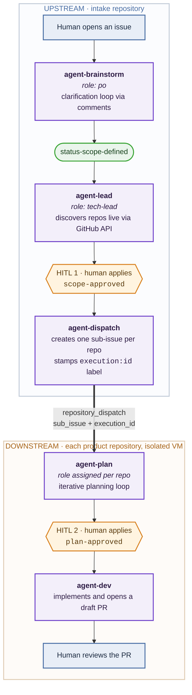
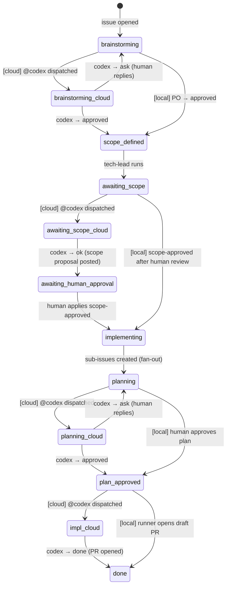

<div align="center">

<h1>agentic-pipeline</h1>

<p>A reusable GitHub Actions library that orchestrates AI agents across repositories —<br>
with human-in-the-loop gates, multi-CLI support, and hard upstream/downstream isolation.</p>


[](https://github.com/features/actions)
[](./actions/run-agent/adapters)
[](./LICENSE)

**[Quick Start](#quick-start) · [Architecture](#architecture) · [Configuration](#configuration) · [Roles & Skills](#roles--skills) · [Adapters](#contributing-an-adapter)**

</div>

> [!WARNING]
> **Proof of Concept** — This repository demonstrates the orchestration model and pipeline mechanics. See [Known Gaps](#known-gaps) before using in production.

---

## What is this?

`agentic-pipeline` is a **platform library**, not an application. Product repositories call a single `uses:` line and get fully orchestrated AI agents — CLI resolution, model selection, skill discovery, MCP wiring, and human-approval gates included. It defines **how** agents run; it never holds product code or demands.

It provides:

- **Role-based agents** (`po`, `tech-lead`, `frontend-engineer`, `backend-engineer`, `qa`) whose system prompts are stack-agnostic — stack knowledge lives in *skills*, not role names
- **Multi-CLI support** via swappable adapters: Claude Code, Cursor, Codex, or `dry-run` (mechanics validated, no model called)
- **Three-level configuration** where platform governance is always the final veto, but repos keep meaningful defaults
- **Two human-in-the-loop gates** — one between scope definition and planning, one between planning and implementation
- **Strict isolation** — each product repo runs in its own VM; no shared context, no cross-repo secrets

---

## Architecture



### Upstream / Downstream boundary

The pipeline has a hard separation between two worlds. Intake orchestrates demand; product repos execute it. Nothing crosses the boundary except a sub-issue body and a correlation token.

| | Upstream | Downstream |
|---|---|---|
| **Repos** | intake repository | `app-poc-1`, `app-poc-2`, any product repo |
| **Trigger** | Human opens a GitHub Issue | `repository_dispatch` from `agent-dispatch` |
| **Agent sees** | Demand description + repo fingerprints (GitHub API) | Only its sub-issue + approved plan |
| **Token scope** | `issues: write`, `contents: read` | `contents: write`, `pull-requests: write` |
| **Shared context** | None | None — independent VMs per repo |
| **Platform ref** | `@v1` | `@v1` |

The `execution_id` label — stamped on every sub-issue by `agent-dispatch` — is the only correlation between the two worlds. It ties cost and trace back to the original demand without exposing the original prompt to the downstream agent.

---

## Quick Start

### 1 · Create `.agentic/config.yml` in your product repo

```yaml
version: 1

defaults:
  cli: claude-code              # or: cursor | codex | dry-run
  models:
    frontend-engineer: claude-sonnet-4-6

constraints:
  forbid_paths:
    - .env
    - secrets/

# Optional — episodic memory across runs
memory:
  enabled: false
  max_episodes: 20
```

There is no registration step. `agent-lead` discovers eligible repositories live from the organization via the GitHub API, reading each repo's description and README excerpt, and decides scope by semantic judgment rather than a maintained list.

### 2 · Add the workflow caller

Create `.github/workflows/agentic.yml` in your product repo:

```yaml
name: agentic

on:
  repository_dispatch:
    types: [agentic-dev]

jobs:
  implement:
    uses: renanlalier/agentic-pipeline/.github/workflows/agent-dev.yml@v1
    with:
      role: frontend-engineer
      sub_issue: ${{ github.event.client_payload.sub_issue }}
    secrets:
      ANTHROPIC_API_KEY: ${{ secrets.ANTHROPIC_API_KEY }}
```

Only forward the key for the CLI you actually use. With `cli: dry-run` the `secrets:` block can be omitted entirely — the mechanics run without calling any model.

### 3 · Set secrets

| Secret | Scope | Required when |
|---|---|---|
| `PIPE_TOKEN` | intake repo | Always — cross-repo issue creation and `repository_dispatch` |
| `ANTHROPIC_API_KEY` | each product repo | `cli: claude-code` |
| `OPENAI_API_KEY` | each product repo | `cli: codex` |
| `CURSOR_API_KEY` | each product repo | `cli: cursor` |
| `CONTEXT7_API_KEY` | each product repo | Optional — consumed by MCP servers in `brain/mcp/servers.yml` |

`agent-dev` runs a preflight that resolves the CLI and fails with an explicit message when its key is absent, before creating a branch or commit.

That's it. The platform resolves CLI, model, skills, and MCPs from there.

---

## Configuration

Configuration resolves in three levels. **Level 3 wins; level 1 can always veto.**

### Level 1 — `config/allowlist.yml` (this repo)

Edited by Platform Engineering and Security. Defines what is permitted to exist at all: approved CLIs, approved models per role, cost budgets. A repo config or demand override can only select from this list.

```yaml
clis:
  claude-code:
    approved: true
    adapter: actions/run-agent/adapters/claude-code.sh

models:
  frontend-engineer: [dry-run, claude-sonnet-4-6, gpt-5]

budgets:
  default_usd_per_demand: 5
  hard_stop_usd_per_demand: 10
  max_retries_per_role: 2
```

### Level 2 — `.agentic/config.yml` in each product repo

Repo-level defaults. Cannot select a CLI or model absent from the allowlist. Also carries `defaults.base_url`, forwarded to the adapter as `ANTHROPIC_BASE_URL` for LiteLLM or any other Anthropic-compatible proxy.

### Level 3 — issue form or `repository_dispatch` payload

Per-demand overrides via `cli_override` and `model_override`. Useful for testing a new model on a single demand without changing any config file. The allowlist still vetoes.

---

## Roles & Skills

Roles are **generalists by design**. The role `frontend-engineer` carries no framework name — that belongs in a skill.

| Role | Phase | Runs in |
|---|---|---|
| `po` | Brainstorm — clarifies the demand | intake |
| `tech-lead` | Scope — decides which repos are affected | intake |
| `frontend-engineer` | Implementation | product repo |
| `backend-engineer` | Implementation | product repo |
| `qa` | Validation | product repo |

### Platform skills (available to all repos)

| Skill | Purpose |
|---|---|
| `brainstorming` | Structured clarification loop for the PO phase |
| `writing-plans` | Plan format and iteration protocol for the planning phase |
| `commit-convention` | Conventional Commits with scope rules |
| `evaluate-eligible-repositories` | Scope reasoning over repos discovered from the org |
| `memory-read` / `memory-write` | Episode read/write in `.agentic/memory/` |

### Repo skills — `.agentic/skills/<name>/SKILL.md`

```markdown
---
name: react-best-practices
description: Patterns and conventions for React 18 with Vite and Vitest.
---

## Skill content ...
```

Skills are **discovered, not concatenated**. `run-agent` locates the directories and passes them to the adapter, which loads them in its own CLI-native way. No skill may redefine the protected sections of a role's `system.md` (`<role>`, `<instructions>`, `<constraints>`, `<stop_conditions>`).

---

## Contributing an Adapter

An adapter is a shell script in `actions/run-agent/adapters/`. It receives these env vars and must produce output on stdout:

| Variable | Description |
|---|---|
| `ROLE` | Logical role name |
| `CLI` | Resolved CLI name |
| `MODEL` | Resolved model name |
| `EXECUTION_ID` | Stable demand-scoped correlation token |
| `PROMPT` | The task — always from the issue, never mixed into the system |
| `SYSTEM_FILE` | Path to the sacred role system prompt |
| `PLATFORM_SKILLS_DIR` | Platform skill directory |
| `REPO_SKILLS_DIR` | Repo-specific skill directory |
| `MCP_CONFIG` | Abstract MCP declarations (`brain/mcp/servers.yml`) |
| `MEMORY_DIR` | `.agentic/memory/` if memory is enabled, else empty |
| `AGENTS_MEMORY_FILE` | `.agentic/memory/AGENTS.md` if validated clean |
| `SEMANTIC_MEMORY_FILE` | `.agentic/memory/MEMORY.md` if validated clean |

The provider key your adapter needs must also be declared in the `secrets:` block of `agent-dev.yml` and exposed at job level, or it will not reach the adapter process.

Register the adapter in `config/allowlist.yml` under `clis:`. No other file changes.

---

## Memory

When `memory.enabled: true` in `.agentic/config.yml`, the platform injects two context files into the agent run:

- **`AGENTS.md`** — how roles collaborate in this repo
- **`MEMORY.md`** — semantic facts to carry across runs (decisions, constraints, conventions)
- **`episodes/`** — timestamped files written by `memory-write`, loaded selectively by `memory-read`

**Security**: files containing XML tags matching protected system-prompt sections are blocked before injection and flagged in the job summary. The run continues without memory.

---

## Codex Cloud Mode

In addition to running AI agents locally on the GitHub Actions runner, the pipeline
supports **cloud delegation** via the [Codex Cloud GitHub App](https://chatgpt.com/codex).
In this mode the runner posts `@codex [<role> agent] <task>` as an issue comment instead
of executing a CLI, and the Codex App picks up the work in its own environment.

### How it works

1. `run-agent` resolves `execution_target` (level 3 input → level 2 `.agentic/config.yml`
   `.defaults.execution_target` → default `local`).
2. If `execution_target == cloud` and `cli == codex`, the action posts an `@codex` comment
   and returns a synthetic `dispatched_to_cloud` result. No CLI is installed or executed.
3. The caller (brainstorm / lead / plan / dev) applies labels:
   - Its stage label (`status-brainstorming`, `status-planning`, …)
   - `status-awaiting-codex-response` — signals that the pipeline is waiting for the bot
4. The Codex bot reacts with 👀, executes the task inside its environment, then posts
   a response comment ending with a marker:
   - `<!-- codex:status:ask -->` — needs clarification; human replies; pipeline re-dispatches
   - `<!-- codex:status:approved -->` — task concluded; pipeline advances state
   - `<!-- codex:status:done -->` — implementation done; bot has opened a draft PR
   - `<!-- codex:status:escalated -->` — bot could not proceed; human must intervene
5. `codex-response-received` job (in each repo's caller workflow) detects the bot comment,
   reads the marker, and applies the correct label transition.
6. An audit comment with `<!-- pipe:audit -->` is posted on every bot response to provide
   a trace link and prevent re-triggering loops.

### State diagram



> `status-awaiting-codex-response` is always an **additional** label coexisting with the
> stage label. The `codex-response-received` job uses the combination to infer the stage.
> Anti-loop: Codex bot responses never contain `<!-- pipe: -->` markers, so existing guards
> (`sender.login != 'codex[bot]'` + `<!-- pipe: -->` body check) naturally prevent loops.

### Role contracts in cloud mode

Role contracts (`brain/agents/<role>/agent.yml`) never travel as inline comment text.
Instead, each Codex Cloud environment runs a **setup script** that:

1. Clones `renanlalier/agentic-pipeline` at `--branch v1`
2. Calls `brain/agents/to-codex-toml.sh <role>` for each relevant role
3. Writes the generated `.codex/agents/<role>.toml` into the project

The TOML contains `developer_instructions` (the full XML system prompt), `description`
(used by Codex for automatic routing), and `[mcp_servers.*]` blocks from
`brain/mcp/servers.yml`. No TOML files are committed to product repositories.

### Enabling cloud mode

Set the `CODEX_EXECUTION_TARGET` repository variable to `cloud` in GitHub Actions
settings, or pass `cli_override: codex` + `execution_target: cloud` in a
`repository_dispatch` payload for per-demand overrides.

All per-repo setup (GitHub App authorization, environment creation, secrets) is covered
in [docs/runbook-codex-cloud-setup.md](./docs/runbook-codex-cloud-setup.md).

---

## Versioning

Callers always pin to a tag, never `@main`.

```bash
git tag -f v1 && git push -f origin v1
```

A breaking change increments the tag (`v2`). Product repos opt into the new version explicitly.

---

## Known Gaps

This is a proof-of-concept. The table below documents what is described in this README but not yet fully proven on disk.

| Gap | Detail | Impact |
|---|---|---|
| Cursor skill directory unverified | `cursor.sh` copies skills to `.cursor/skills/`, assuming parity with Claude Code's open Agent Skills format. Not confirmed against current Cursor CLI docs | If the path is wrong, skills are silently never loaded — no error surfaces |
| Budgets are declarative only | `config/allowlist.yml` defines `budgets`, but nothing enforces them at runtime | A demand can exceed `hard_stop_usd_per_demand` without being stopped |
| `gateway.enabled` is inert | The allowlist declares a gateway block with required attribution headers; `run-agent` prints the headers but no gateway consumes them | Per-user cost attribution is not enforced end to end |
| No automated tests | The pipeline has no test suite validating adapter contracts or config resolution | Regressions surface only at runtime, inside a real demand |
| Mixed `actions/checkout` versions | `agent-plan.yml` still pins `@v4`; the other workflows use `@v5` | Cosmetic today, but a drift point when checkout behaviour changes |

---

<div align="center">
<sub>Built with GitHub Actions · No standing jobs · No shared context between repos</sub>
</div>
