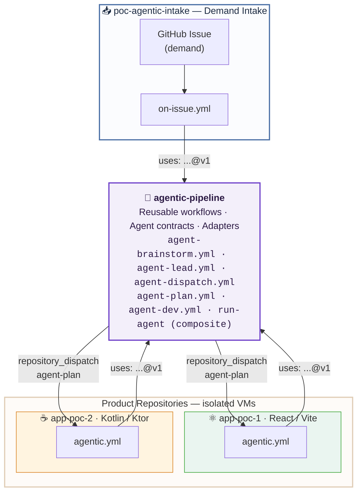
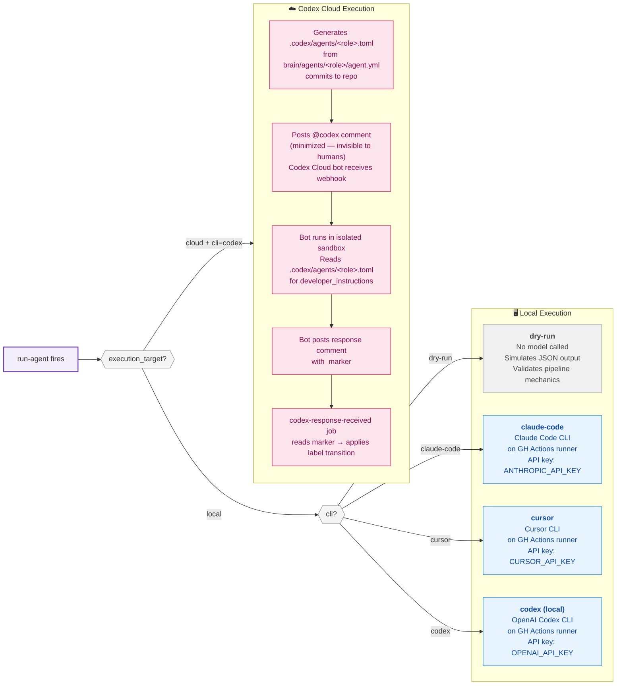
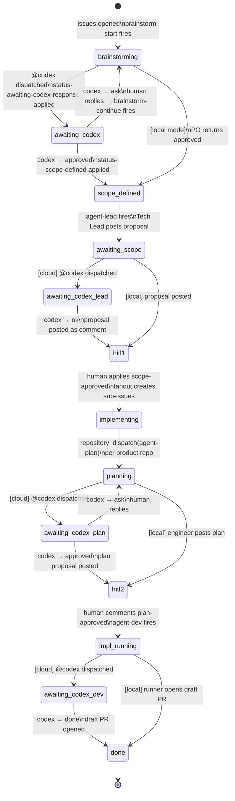
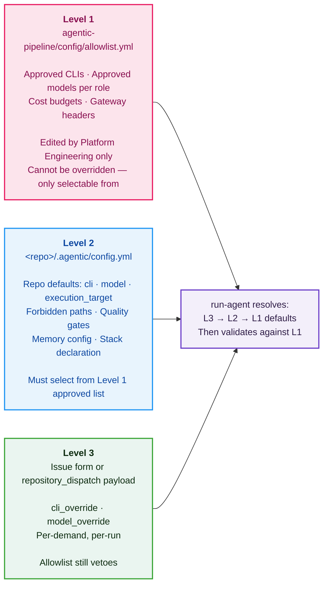

<div align="center">

<h1>agentic-pipeline</h1>

<p>A reusable GitHub Actions library that orchestrates AI agents across repositories —<br>
with human-in-the-loop gates, multi-CLI support, and hard upstream/downstream isolation.</p>


[](https://github.com/features/actions)
[](./actions/run-agent/adapters)
[](./LICENSE)

**[Repositories](#repositories) · [Architecture](#architecture) · [Phases](#phases) · [Execution Modes](#execution-modes) · [Configuration](#configuration) · [Roles & Skills](#roles--skills) · [Adapters](#adapters)**

</div>

> [!WARNING]
> **Proof of Concept** — This repository demonstrates the orchestration model and pipeline mechanics. See [Known Gaps](#known-gaps) before using in production.

---

## What is this?

`agentic-pipeline` is a **platform library**, not an application. It provides reusable GitHub Actions workflows, role-based agent contracts, and CLI adapters. Product repositories call a single `uses:` line and get fully orchestrated AI agents — CLI resolution, model selection, skill discovery, MCP wiring, and human-approval gates included.

It defines **how** agents run. It never holds product code or demands.

---

## Repositories

This POC spans four independent Git repositories. Each has a distinct role and is never mixed with the others.

```
renanlalier/
├── agentic-pipeline/       ← YOU ARE HERE — platform library
├── poc-agentic-intake/     ← demand intake (GitHub Issues portal)
├── app-poc-1/              ← product: frontend (React 18 / Vite)
└── app-poc-2/              ← product: backend (Kotlin / Ktor)
```

| Repository | Role | GitHub Actions trigger | Agents enabled |
|---|---|---|---|
| `agentic-pipeline` | Platform library — provides reusable workflows, agents, adapters | Never triggered directly. Called via `uses: renanlalier/agentic-pipeline/...@v1` | n/a |
| `poc-agentic-intake` | Demand intake portal. All demands start here as GitHub Issues | `issues.opened`, `issues.labeled`, `issue_comment.created` | `po`, `tech-lead` |
| `app-poc-1` | Product repo — frontend | `repository_dispatch` (type: `agent-plan`) | `frontend-engineer`, `qa` |
| `app-poc-2` | Product repo — backend | `repository_dispatch` (type: `agent-plan`) | `backend-engineer`, `qa` |

---

## Architecture

### Repository map



### Full pipeline flow

```mermaid
flowchart TD
    A(["👤 Human opens Issue\npoc-agentic-intake"]):::human

    subgraph PH1["Phase 1 · Brainstorm — poc-agentic-intake"]
        B["<b>on-issue.yml</b> fires\n<i>trigger: issues.opened</i>"]:::workflow
        C["calls agent-brainstorm.yml@v1\n<i>role: po · model: codex-1</i>"]:::reusable
        D["run-agent composite action\nresolves config → validates allowlist\ngenerates .codex/agents/po.toml"]:::action
        E{{"Execution\nTarget?"}}:::decision
        EL["Local adapter runs\nclaude-code / cursor / codex CLI\non GitHub Actions runner"]:::local
        EC["Posts @codex comment\n(minimized after post)\nCodex Cloud bot picks up task"]:::cloud
        F["Bot/agent replies with\n<!-- codex:status:ask -->\nor <!-- codex:status:approved -->"]:::agent
        G["codex-response-received job\nor Act-on-PO-decision step\nreads status marker"]:::workflow
    end

    H{{"status?"}}:::decision
    HASK["Post question\nas issue comment\nadd status-brainstorming"]:::state
    HAPP["Fill ## Scope section\nadd status-scope-defined\nremove status-brainstorming"]:::state

    subgraph PH2["Phase 2 · Scope Proposal — poc-agentic-intake"]
        I["<b>on-issue.yml</b> fires\n<i>trigger: issues.labeled = status-scope-defined</i>"]:::workflow
        J["calls agent-lead.yml@v1\n<i>role: tech-lead · model: codex-1</i>"]:::reusable
        K["Tech Lead reads org repos\nvia GitHub API fingerprint\nproposes repo ↔ role table"]:::agent
    end

    HITL1{{"👤 HITL 1\nHuman applies label\nscope-approved"}}:::gate

    subgraph PH3["Phase 3 · Fanout — poc-agentic-intake"]
        L["<b>on-issue.yml</b> fires\n<i>trigger: issues.labeled = scope-approved</i>"]:::workflow
        M["calls agent-dispatch.yml@v1"]:::reusable
        N["For each approved repo:\n• creates cross-repo sub-issue\n• links as GitHub sub-issue\n• stamps execution:exec-N label\n• sends repository_dispatch(agent-plan)"]:::action
    end

    subgraph PH4["Phase 4 · Plan — each product repo (isolated VM)"]
        O["<b>agentic.yml</b> fires\n<i>trigger: repository_dispatch · type: agent-plan</i>"]:::workflow
        P["calls agent-plan.yml@v1\n<i>role assigned per repo</i>"]:::reusable
        Q["Engineer reads sub-issue\nproposes technical plan\nasks clarifying questions"]:::agent
    end

    HITL2{{"👤 HITL 2\nHuman comments\nplan-approved"}}:::gate

    subgraph PH5["Phase 5 · Implement — each product repo (isolated VM)"]
        R["<b>agentic.yml</b> fires\n<i>trigger: issue_comment.created = plan-approved</i>"]:::workflow
        S["calls agent-dev.yml@v1\n<i>role: frontend/backend-engineer</i>"]:::reusable
        T["Runs quality gates\nbuild · test\nOpens draft PR"]:::action
    end

    U(["👤 Human reviews\ndraft PR"]):::human

    A --> B --> C --> D --> E
    E -->|local| EL --> F
    E -->|cloud| EC --> F
    F --> G --> H
    H -->|ask| HASK --> A
    H -->|approved| HAPP --> I
    I --> J --> K --> HITL1
    HITL1 --> L --> M --> N
    N -->|"repository_dispatch\n× N repos"| O
    O --> P --> Q --> HITL2
    HITL2 --> R --> S --> T --> U

    classDef human fill:#e8eef7,stroke:#4a6fa5,stroke-width:2px,color:#1b2a41
    classDef workflow fill:#eaf5f0,stroke:#3da639,stroke-width:2px,color:#0d2b10
    classDef reusable fill:#f3effa,stroke:#6e40c9,stroke-width:2px,color:#2d1b45
    classDef action fill:#fefbf8,stroke:#e0cdb6,stroke-width:2px,color:#5c3a0a
    classDef agent fill:#fff9f0,stroke:#d98324,stroke-width:2px,color:#5c3a0a
    classDef gate fill:#fff4e0,stroke:#d98324,stroke-width:3px,color:#5c3a0a
    classDef state fill:#eaf5ec,stroke:#3da639,stroke-width:1px,color:#14411a
    classDef decision fill:#f5f5f5,stroke:#888,stroke-width:1px,color:#333
    classDef local fill:#e8f4fd,stroke:#2196f3,stroke-width:1px,color:#0d47a1
    classDef cloud fill:#fce4ec,stroke:#e91e63,stroke-width:1px,color:#880e4f
```



---

## Phases

### Phase 1 — Brainstorm

| Field | Detail |
|---|---|
| **Trigger** | `issues.opened` in `poc-agentic-intake` |
| **Workflow** | `poc-agentic-intake/.github/workflows/on-issue.yml` → calls `agentic-pipeline/agent-brainstorm.yml@v1` |
| **Agent** | `po` (Product Owner) |
| **Loop** | Each human comment re-triggers `brainstorm-continue` job (while `status-brainstorming` label is present and sender is not the Codex bot) |
| **Anti-loop guard** | Pipeline comments carry `<!-- pipe:brainstorm -->`. Codex bot comments are excluded by `sender.login` check (`chatgpt-codex-connector[bot]`). Comments marked `status-awaiting-codex-response` are skipped. |
| **Outputs** | `status: ask` → posts question, keeps `status-brainstorming`<br>`status: approved` → fills `## Scope` in issue body, applies `status-scope-defined`<br>`status: escalated` → posts reason, stops |

### Phase 2 — Scope Proposal

| Field | Detail |
|---|---|
| **Trigger** | `issues.labeled = status-scope-defined` in `poc-agentic-intake` |
| **Workflow** | `on-issue.yml` (job: `propose-scope`) → calls `agentic-pipeline/agent-lead.yml@v1` |
| **Agent** | `tech-lead` |
| **What it does** | Reads all org repos via GitHub API, checks each repo's description and README, applies `evaluate-eligible-repositories` skill, produces a markdown table: `repo \| role \| why \| type` |
| **Gate** | Human reads the proposal and applies `scope-approved` label manually |

### Phase 3 — Fanout

| Field | Detail |
|---|---|
| **Trigger** | `issues.labeled = scope-approved` in `poc-agentic-intake` |
| **Workflow** | `on-issue.yml` (job: `fanout`) → calls `agentic-pipeline/agent-dispatch.yml@v1` |
| **What it does** | Parses the Tech Lead's approved table. For each repo: creates a cross-repo sub-issue (via REST `/sub_issues`), stamps `execution:exec-N` and `type/<type>` labels, sends `repository_dispatch(agent-plan)` |
| **Correlation token** | `execution_id = exec-<issue-number>` — stamped on every sub-issue as a label. This is the only link between upstream and downstream. No prompt content crosses the boundary. |
| **Result** | Parent issue gets `status-implementing`. Product repos' workflows fire independently in isolated VMs. |

### Phase 4 — Plan

| Field | Detail |
|---|---|
| **Trigger** | `repository_dispatch` with `event_type: agent-plan` in each product repo |
| **Workflow** | `app-poc-1/.github/workflows/agentic.yml` or `app-poc-2/...` → calls `agentic-pipeline/agent-plan.yml@v1` |
| **Agent** | `frontend-engineer` (app-poc-1) or `backend-engineer` (app-poc-2) |
| **Loop** | Each human comment re-triggers planning iteration while `status-planning` is present |
| **Gate** | Human comments `plan-approved` on the sub-issue |

### Phase 5 — Implement

| Field | Detail |
|---|---|
| **Trigger** | `issue_comment.created` containing `plan-approved` on a sub-issue with `status-planning` label |
| **Workflow** | `agentic.yml` → calls `agentic-pipeline/agent-dev.yml@v1` |
| **Agent** | Same role as planning (`frontend-engineer` or `backend-engineer`) |
| **Quality gates** | Runs `build` and `test` after implementation. Configurable in `.agentic/config.yml` under `gates:` |
| **Output** | Draft PR opened against `main`. Labels: `agentic`. Sub-issue gets `status-done`. |

---

## Execution Modes

Every agent run goes through `run-agent` (composite action), which resolves the execution mode from three levels of config. The mode determines what actually runs.



### Mode comparison

| | `dry-run` | Local CLI | Codex Cloud |
|---|---|---|---|
| **Model called** | No | Yes | Yes (via Codex Cloud) |
| **Runs on** | GH Actions runner | GH Actions runner | Codex Cloud sandbox |
| **API key needed** | None | CLI-specific | None (GitHub App) |
| **Config** | `cli: dry-run` | `cli: claude-code \| cursor \| codex` + `execution_target: local` | `cli: codex` + `execution_target: cloud` |
| **Output** | Synthetic JSON | Real agent output | Codex bot comment |
| **Pipeline sees** | Simulated result | Adapter stdout | `<!-- codex:status:X -->` marker |
| **Useful for** | Validating mechanics, CI, cost-zero testing | Full local execution | Codex Cloud subscription users |

### POC default configuration

All three product/intake repos are currently set to **Codex Cloud**:

```
poc-agentic-intake   → cli: codex · execution_target: cloud · po/tech-lead: codex-1
app-poc-1            → cli: codex · execution_target: cloud · frontend-engineer/qa: codex-1
app-poc-2            → cli: codex · execution_target: cloud · backend-engineer/qa: codex-1
```

---

## Event & Trigger Map

| Event | Repo | Condition | Job triggered | Calls |
|---|---|---|---|---|
| `issues.opened` | `poc-agentic-intake` | — | `brainstorm-start` | `agent-brainstorm.yml@v1` |
| `issue_comment.created` | `poc-agentic-intake` | sender ≠ bot + `status-brainstorming` label + no `status-awaiting-codex-response` | `brainstorm-continue` | `agent-brainstorm.yml@v1` |
| `issue_comment.created` | `poc-agentic-intake` | sender = `chatgpt-codex-connector[bot]` + `status-awaiting-codex-response` | `codex-response-received` | _(inline steps)_ |
| `issues.labeled` | `poc-agentic-intake` | label = `status-scope-defined` | `propose-scope` | `agent-lead.yml@v1` |
| `issues.labeled` | `poc-agentic-intake` | label = `scope-approved` | `fanout` | `agent-dispatch.yml@v1` |
| `repository_dispatch` | `app-poc-1`, `app-poc-2` | type = `agent-plan` | `implement` | `agent-plan.yml@v1` |
| `issue_comment.created` | `app-poc-1`, `app-poc-2` | comment = `plan-approved` + `status-planning` label | `implement` | `agent-dev.yml@v1` |

---

## Codex Cloud — State Machine

When `execution_target: cloud` is active, the pipeline becomes a state machine driven by Codex bot responses rather than synchronous adapter output.



### How the bot response is processed

```
Codex bot posts comment
  └── codex-response-received job fires (on-issue.yml in intake)
        ├── extracts <!-- codex:status:X --> marker from comment body
        ├── removes status-awaiting-codex-response label
        ├── reads current labels to identify stage
        └── applies transition:
              brainstorming + ask     → keep status-brainstorming
              brainstorming + approved → remove status-brainstorming
                                         add status-scope-defined
              awaiting-scope + ok     → keep for human review (scope-approved)
              escalated               → remove labels, log, stop
```

### Role contract delivery in cloud mode

In Codex Cloud, the agent runs in a repo sandbox — not in the GitHub Actions runner. The system prompt must reach it via the repo's `.codex/agents/<role>.toml` file.

`run-agent` generates and commits this file automatically before dispatching:

```
brain/agents/<role>/agent.yml          ← source of truth (platform owns this)
        ↓  to-codex-toml.sh
.codex/agents/<role>.toml              ← generated at dispatch time, committed to repo
        ↓  Codex Cloud reads
developer_instructions = """           ← role contract (XML system prompt, cloud output format)
```

The TOML is regenerated on every dispatch. Product repos never maintain it manually. The platform is always the source of truth.

---

## Configuration

Configuration resolves in three levels. **Level 3 wins on values; Level 1 always vetoes.**



### Level 1 — `config/allowlist.yml` (this repo)

```yaml
clis:
  dry-run:    { approved: true, adapter: actions/run-agent/adapters/dry-run.sh }
  claude-code: { approved: true, adapter: actions/run-agent/adapters/claude-code.sh }
  cursor:     { approved: true, adapter: actions/run-agent/adapters/cursor.sh }
  codex:      { approved: true, adapter: actions/run-agent/adapters/codex.sh }

models:
  po:                 [dry-run, codex-1, claude-sonnet-4-6, gpt-5-mini]
  tech-lead:          [dry-run, codex-1, claude-opus-5, claude-sonnet-4-6]
  frontend-engineer:  [dry-run, codex-1, claude-sonnet-4-6, gpt-5]
  backend-engineer:   [dry-run, codex-1, claude-sonnet-4-6, gpt-5]
  qa:                 [dry-run, codex-1, claude-sonnet-4-6]

budgets:
  default_usd_per_demand: 5
  hard_stop_usd_per_demand: 10
```

### Level 2 — `.agentic/config.yml` per repo

```yaml
# app-poc-1 example
version: 1
repo_role: product
defaults:
  cli: codex
  execution_target: cloud        # local | cloud
  models:
    frontend-engineer: codex-1

roles_enabled: [frontend-engineer, qa]
stack: { runtime: node@22, framework: react, bundler: vite }

constraints:
  forbid_paths: [.github/workflows/**, .agentic/config.yml]
  forbid_dependencies_add: true

memory:
  enabled: true
  max_episodes: 20

gates: [build, test]
pr: { base_branch: main, draft: true, labels: [agentic] }
```

### Level 3 — Dispatch payload override

```yaml
# In poc-agentic-intake/.github/workflows/on-issue.yml
with:
  cli_override: ""              # leave empty to use Level 2 default
  model_override: ""            # leave empty to use Level 2 default
  execution_target: ""          # leave empty to use Level 2 default
```

---

## Roles & Skills

Roles are **stack-agnostic by design**. The name `frontend-engineer` carries no framework. Stack knowledge lives in skills, loaded on demand.

### Roles

| Role | Phases | Runs in | System prompt location |
|---|---|---|---|
| `po` | Brainstorm | `poc-agentic-intake` | `brain/agents/po/agent.yml` |
| `tech-lead` | Scope proposal | `poc-agentic-intake` | `brain/agents/tech-lead/agent.yml` |
| `frontend-engineer` | Plan + Implement | `app-poc-1` | `brain/agents/frontend-engineer/agent.yml` |
| `backend-engineer` | Plan + Implement | `app-poc-2` | `brain/agents/backend-engineer/agent.yml` |
| `qa` | Validate | `app-poc-1`, `app-poc-2` | `brain/agents/qa/agent.yml` |

Each `agent.yml` contains:
- `name`, `description`, `version`
- `mcps` — list of allowed MCP server names (must match keys in `brain/mcp/servers.yml`)
- `system` — XML-tagged sacred system prompt (`<role>`, `<context>`, `<instructions>`, `<constraints>`, `<stop_conditions>`, `<output_format>`, `<precedence>`)

**The `system` field is sacred — no skill, repo config, or memory file may override any of its sections.**

### Platform skills

Available to all repos and all roles. Loaded on demand by the adapter, not concatenated at boot.

| Skill | Purpose |
|---|---|
| `brainstorming` | Structured clarification loop protocol for the PO phase |
| `writing-plans` | Plan format and iteration protocol for the planning phase |
| `commit-convention` | Conventional Commits with scope rules |
| `evaluate-eligible-repositories` | Semantic scope reasoning over repos discovered from the org |
| `react-best-practices` | React 18 / Vite / Vitest patterns (loaded in app-poc-1 runs) |

### Repo skills — `.agentic/skills/<name>/SKILL.md`

```markdown
---
name: react-best-practices
description: Patterns and conventions for React 18 with Vite and Vitest.
---

## Skill content ...
```

Discovered by `run-agent`, passed as directories to the adapter. The adapter loads them in its own CLI-native way. No skill may redefine the protected system prompt sections.

---

## Adapters

An adapter is a shell script in `actions/run-agent/adapters/`. It receives a fixed env-var contract and must write a JSON object to stdout.

### Input contract (env vars)

| Variable | Description |
|---|---|
| `ROLE` | Logical role name (`po`, `frontend-engineer`, …) |
| `CLI` | Resolved CLI name |
| `MODEL` | Resolved model name |
| `EXECUTION_ID` | Stable demand-scoped correlation token (e.g. `exec-42`) |
| `PROMPT` | The task — always from the issue, never mixed into the system prompt |
| `SYSTEM_FILE` | Path to the role's XML system prompt extracted from `agent.yml` |
| `PLATFORM_SKILLS_DIR` | `brain/skills/` — shared, platform-managed |
| `REPO_SKILLS_DIR` | `.agentic/skills/` — repo-specific, agent-writable |
| `MCP_CONFIG` | Abstract MCP declarations (`brain/mcp/servers.yml`) |
| `MEMORY_DIR` | `.agentic/memory/` if memory is enabled, else empty |
| `AGENTS_MEMORY_FILE` | `.agentic/memory/AGENTS.md` if validated clean |
| `SEMANTIC_MEMORY_FILE` | `.agentic/memory/MEMORY.md` if validated clean |

### Output contract (stdout JSON)

```json
{
  "role": "frontend-engineer",
  "execution_id": "exec-42",
  "status": "ask | approved | escalated | done | dispatched_to_cloud",
  "question": "...",
  "scope": "...",
  "notes": "...",
  "token_usage": {
    "input_tokens": 1234,
    "output_tokens": 567,
    "cache_read_input_tokens": 0,
    "cache_creation_input_tokens": 0
  }
}
```

All adapters must include `token_usage`. With `dry-run` all counts are zero; with `dispatched_to_cloud` all counts are zero (execution happens in Codex Cloud, not the runner).

### Registering a new adapter

1. Add `adapters/my-cli.sh` with the env-var contract above
2. Register in `config/allowlist.yml` under `clis:`
3. No other file changes needed

---

## MCP Servers

`brain/mcp/servers.yml` declares MCP servers abstractly. Each adapter translates this to its CLI's native config format — no adapter shares a config syntax.

```yaml
servers:
  context7:
    description: >
      Resolves library names to IDs and fetches up-to-date documentation.
      Prevents hallucination of outdated APIs.
    remote:
      transport: http
      url: https://mcp.context7.com/mcp
      api_key_env: CONTEXT7_API_KEY   # optional — only raises rate limits
```

Context7 works without an API key. Setting `CONTEXT7_API_KEY` in the job environment only raises the rate limit — it is not required.

---

## Memory

When `memory.enabled: true` in `.agentic/config.yml`, `run-agent` injects three context sources:

| File | Purpose | Written by |
|---|---|---|
| `.agentic/memory/AGENTS.md` | How roles collaborate in this repo | Human or agent |
| `.agentic/memory/MEMORY.md` | Semantic facts across runs (decisions, constraints, conventions) | Human or agent |
| `.agentic/memory/episodes/` | Timestamped execution snapshots | `memory-write` skill |

**Security**: Any memory file containing XML tags that match protected system prompt sections (`<role>`, `<instructions>`, `<constraints>`, `<stop_conditions>`) is blocked before injection and flagged in the job summary. The run continues without memory — it is never aborted by a bad memory file.

---

## Secrets Reference

| Secret | Where to set | Required when |
|---|---|---|
| `PIPE_TOKEN` | `poc-agentic-intake` | Always — cross-repo issue creation and `repository_dispatch` |
| `ANTHROPIC_API_KEY` | each product repo | `cli: claude-code` |
| `OPENAI_API_KEY` | each product repo | `cli: codex` (local mode) |
| `CURSOR_API_KEY` | each product repo | `cli: cursor` |
| `CONTEXT7_API_KEY` | each product repo | Optional — raises MCP rate limit |

With `cli: dry-run` or `execution_target: cloud`, no model API key is needed on the runner.

---

## Versioning

Callers always pin to a tag, never `@main`.

```bash
# After any platform change:
git tag -f v1 && git push -f origin v1
```

A breaking change increments the tag (`v2`). Product repos opt into the new version explicitly by updating their `uses:` lines.

---

## Known Gaps

| Gap | Detail | Impact |
|---|---|---|
| Budgets are declarative only | `config/allowlist.yml` defines `budgets` but nothing enforces them at runtime | A demand can exceed `hard_stop_usd_per_demand` without being stopped |
| `gateway.enabled` is inert | `run-agent` prints attribution headers but no gateway consumes them | Per-user cost attribution is not enforced end to end |
| Cursor skill path unverified | `cursor.sh` copies skills to `.cursor/skills/`, assuming parity with Claude Code's open Agent Skills format | If the path is wrong, skills are silently never loaded |
| No automated tests | The pipeline has no test suite validating adapter contracts or config resolution | Regressions surface only at runtime inside a real demand |

---

<div align="center">
<sub>Built with GitHub Actions · No standing jobs · No shared context between repos · No product code in the platform</sub>
</div>
