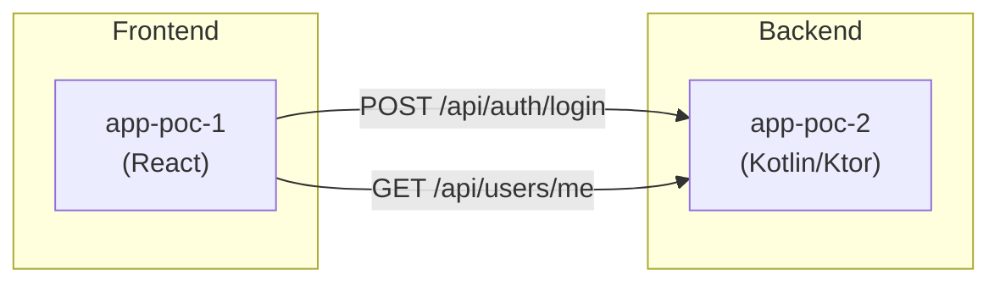
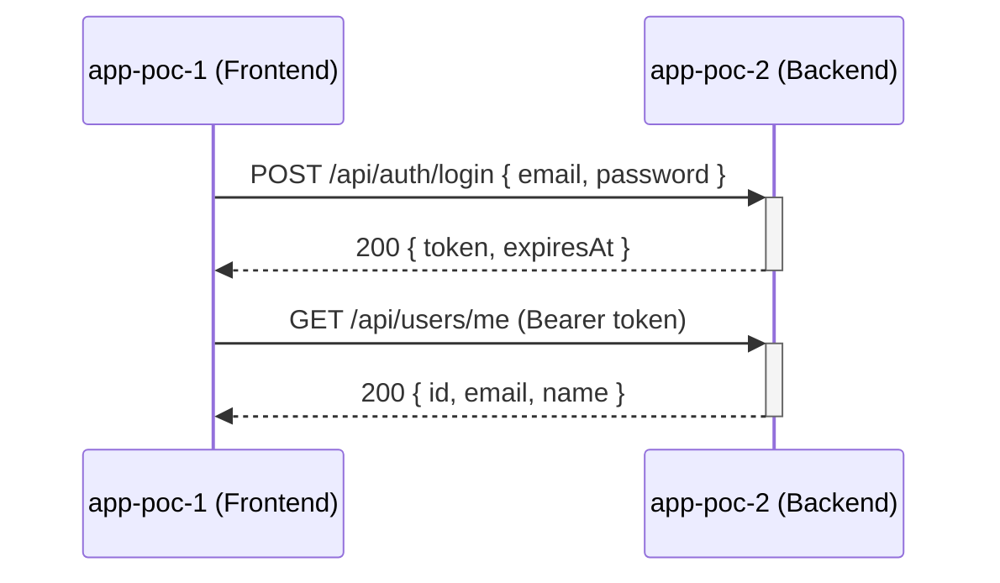
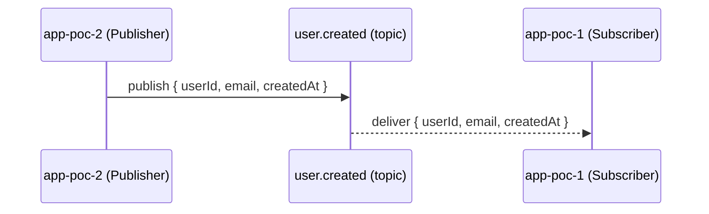

# Skill: Define Integration Contracts

## When this skill applies

When your prompt contains `MODE: CONTRACT_DEFINITION`, you are defining
integration contracts — not proposing scope. The scope has already been
approved by a human.

## Goal

Each engineer implements only their own repository. They have no access to
the other repo's code or developers during the sprint. Your contracts are
the only shared specification they will have. Make them precise enough that
both sides can implement and test independently without additional coordination.

## Structure of the contracts document

The document must contain, in this order:

1. **Architecture diagram** (Mermaid)
2. **Per-pair integration contracts** (one section per interacting repository pair)
3. **Versioning summary**

---

## 1. Architecture diagram

Always open with a Mermaid architecture diagram that shows the complete integration
landscape at a glance. Use a `graph LR` (left-to-right) for the system topology,
followed by a `sequenceDiagram` for each significant request/response or event flow.

### System topology (`graph LR`)

Show every repository in scope as a node and every integration as a labeled edge.
Use subgraphs to group logical layers (e.g., frontend, backend, infrastructure).



### Sequence diagram (one per significant flow)

For each key user-facing scenario, produce a `sequenceDiagram` showing the message
exchange. Use `activate` / `deactivate` for blocking calls. Label each arrow with
the HTTP method + path or event name + payload summary.



For async / event-driven integrations, include the broker as a participant:



---

## 2. REST API contract — OpenAPI 3.0

For every REST integration, produce a complete **OpenAPI 3.0 YAML snippet**. Do not
use a simple markdown table — the OpenAPI format is machine-readable, unambiguous,
and familiar to all engineers regardless of stack.

### Rules

- Use `openapi: "3.0.3"` as the version header.
- Set `info.title` to `"<consumer-repo> → <provider-repo> Contract"`.
- Define all shared data types once in `components/schemas` and reference them with `$ref`.
- Specify `securitySchemes` when auth is required. Apply security at the operation level.
- List every relevant HTTP status code (success + all error cases) in `responses`.
- Do not omit `required` arrays. If a field is optional, say so explicitly.
- Do not write `additionalProperties: true` unless the contract genuinely allows it.
- If the demand does not specify a field, choose a sensible default and add an
  `x-assumption` extension comment explaining the choice.

### Example

```yaml
openapi: "3.0.3"
info:
  title: "app-poc-1 → app-poc-2 Contract"
  version: "v1"
  description: >
    Integration contract for execution exec-42.
    Defines the REST API surface consumed by app-poc-1 (frontend) from app-poc-2 (backend).

servers:
  - url: "http://localhost:8080"
    description: "Local development"

components:
  securitySchemes:
    bearerAuth:
      type: http
      scheme: bearer
      bearerFormat: JWT

  schemas:
    LoginRequest:
      type: object
      required: [email, password]
      properties:
        email:
          type: string
          format: email
          example: "user@example.com"
        password:
          type: string
          minLength: 8
          example: "s3cr3tP@ss"

    AuthToken:
      type: object
      required: [token, expiresAt]
      properties:
        token:
          type: string
          description: "Signed JWT. Lifetime: 1 hour."
          example: "eyJhbGci..."
        expiresAt:
          type: string
          format: date-time
          example: "2026-09-10T15:00:00Z"

    User:
      type: object
      required: [id, email, name]
      properties:
        id:
          type: string
          format: uuid
        email:
          type: string
          format: email
        name:
          type: string

    ErrorResponse:
      type: object
      required: [code, message]
      properties:
        code:
          type: string
          example: "INVALID_CREDENTIALS"
        message:
          type: string
          example: "Email or password is incorrect."

paths:
  /api/auth/login:
    post:
      operationId: login
      summary: "Authenticate a user and obtain a JWT."
      requestBody:
        required: true
        content:
          application/json:
            schema:
              $ref: "#/components/schemas/LoginRequest"
      responses:
        "200":
          description: "Authentication successful."
          content:
            application/json:
              schema:
                $ref: "#/components/schemas/AuthToken"
        "401":
          description: "Invalid credentials."
          content:
            application/json:
              schema:
                $ref: "#/components/schemas/ErrorResponse"
        "422":
          description: "Request body failed validation."
          content:
            application/json:
              schema:
                $ref: "#/components/schemas/ErrorResponse"

  /api/users/me:
    get:
      operationId: getCurrentUser
      summary: "Return the authenticated user's profile."
      security:
        - bearerAuth: []
      responses:
        "200":
          description: "User profile."
          content:
            application/json:
              schema:
                $ref: "#/components/schemas/User"
        "401":
          description: "Missing or invalid token."
          content:
            application/json:
              schema:
                $ref: "#/components/schemas/ErrorResponse"
```

---

## 3. Event / message contract

For async integrations, define each event with the same precision as an OpenAPI schema.

```yaml
events:
  - name: user.created
    topic: "user-events"          # Kafka topic or SQS queue name
    publisher: app-poc-2
    subscriber: app-poc-1
    delivery: at-least-once
    ordering: per-partition        # keyed by userId
    payload:
      schema:
        type: object
        required: [userId, email, createdAt]
        properties:
          userId:
            type: string
            format: uuid
          email:
            type: string
            format: email
          createdAt:
            type: string
            format: date-time
      example:
        userId: "d290f1ee-6c54-4b01-90e6-d701748f0851"
        email: "user@example.com"
        createdAt: "2026-09-10T12:00:00Z"
```

---

## 4. Versioning summary

Close the contracts document with a versioning table covering every contract defined.

```markdown
## Versioning Summary

| Contract | Version | Change strategy | Public |
|---|---|---|---|
| app-poc-1 → app-poc-2 REST API | v1 | Additive-only within v1; breaking changes require v2 path prefix | No (internal) |
| user.created event | v1 | Additive-only; new fields are optional | No (internal) |
```

---

## Output format

Wrap the entire document — diagram, OpenAPI snippets, event contracts, versioning summary —
in the pipeline delimiters:

```
<!-- contracts-begin -->
[full contracts document as described above]
<!-- contracts-end -->
```

End your response with exactly one status marker as the very last line:
- `<!-- codex:status:defined -->` — contracts are defined and ready for dispatch
- `<!-- codex:status:escalated -->` — cannot define contracts without a human decision
  (e.g., whether to use REST or events is an unresolved architectural choice)

---

## Single-repo demands

If the demand only affects one repository and requires no cross-repo integration,
write the following inside the delimiters and still use status `defined`:

````
<!-- contracts-begin -->
## Integration Contracts for <execution_id>

No cross-repository integration contracts apply to this demand.
The change is confined to a single repository and does not affect any shared API,
event schema, or data type consumed by other repositories.


<!-- contracts-end -->
````
