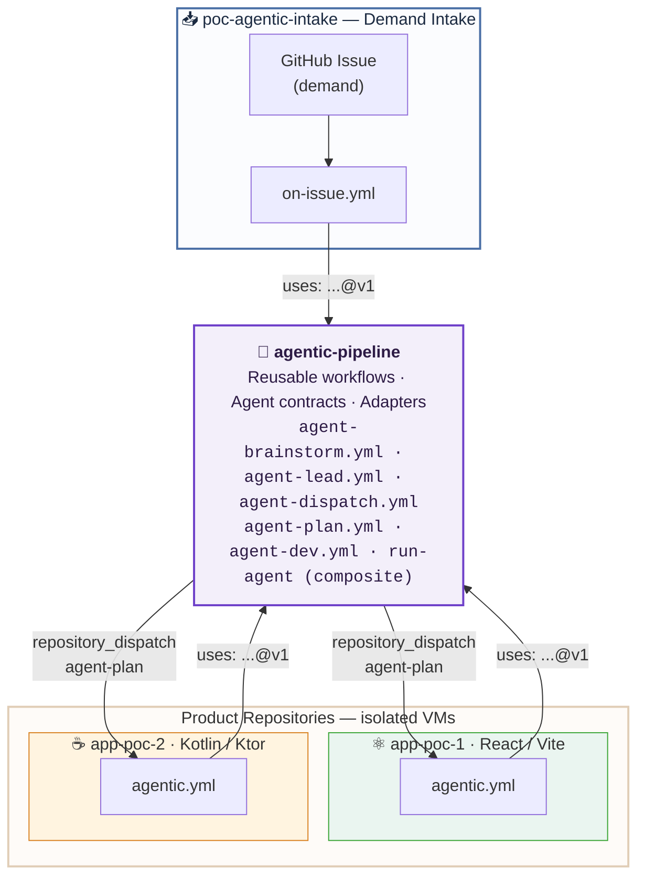

# Architecture

## Repository Map

This POC spans four independent Git repositories. Each has a distinct role and is never mixed with the others.

```
renanlalier/
├── agentic-pipeline/       ← platform library (YOU ARE HERE)
├── poc-agentic-intake/     ← demand intake (GitHub Issues portal)
├── app-poc-1/              ← product: frontend (React 18 / Vite)
└── app-poc-2/              ← product: backend (Kotlin / Ktor)
```

| Repository | Role | Trigger | Agents enabled |
|---|---|---|---|
| `agentic-pipeline` | Platform library — reusable workflows, agents, adapters | Never triggered directly. Called via `uses: renanlalier/agentic-pipeline/...@v1` | n/a |
| `poc-agentic-intake` | Demand intake portal. All demands start here as GitHub Issues | `issues.opened`, `issues.labeled`, `issue_comment.created` | `po`, `tech-lead` |
| `app-poc-1` | Product repo — frontend | `repository_dispatch` (type: `agent-plan`) | `frontend-engineer`, `qa` |
| `app-poc-2` | Product repo — backend | `repository_dispatch` (type: `agent-plan`) | `backend-engineer`, `qa` |



---

## Full Pipeline Flow

```mermaid
flowchart TD
    A(["👤 Human opens Issue\npoc-agentic-intake"]):::human

    subgraph PH1["Phase 1 · Brainstorm — poc-agentic-intake"]
        B["<b>on-issue.yml</b> fires\n<i>trigger: issues.opened</i>"]:::workflow
        C["calls agent-brainstorm.yml@v1\n<i>role: po · model: codex-1</i>"]:::reusable
        D["run-agent composite action\nresolves config → validates allowlist\ngenerates .codex/agents/po.toml"]:::action
        E{{"Execution\nTarget?"}}:::decision
        EL["Local adapter runs\nclaude-code / cursor / codex CLI\non GitHub Actions runner"]:::local
        EC["Posts @codex comment\n(minimized after post)\nCodex Cloud bot picks up task"]:::cloud
        F["Bot/agent replies with\n<!-- codex:status:ask -->\nor <!-- codex:status:approved -->"]:::agent
        G["codex-response-received job\nor Act-on-PO-decision step\nreads status marker"]:::workflow
    end

    H{{"status?"}}:::decision
    HASK["Post question\nas issue comment\nadd brainstorming"]:::state
    HAPP["Fill ### Scope section\nadd scope-defined\nremove brainstorming"]:::state

    subgraph PH2["Phase 2 · Scope Proposal — poc-agentic-intake"]
        I["<b>on-issue.yml</b> fires\n<i>trigger: issues.labeled = scope-defined</i>"]:::workflow
        J["calls agent-lead.yml@v1\n<i>role: tech-lead · model: codex-1</i>"]:::reusable
        K["Tech Lead reads org repos\nvia GitHub API fingerprint\nproposes repo ↔ role table"]:::agent
    end

    HITL1{{"👤 HITL 1\nHuman comments approval\nscope-continue re-invokes Tech Lead\nagent applies scope-approved"}}:::gate

    subgraph PH3["Phase 3 · Fanout — poc-agentic-intake"]
        L["<b>on-issue.yml</b> fires\n<i>trigger: issues.labeled = scope-approved</i>"]:::workflow
        M["calls agent-dispatch.yml@v1"]:::reusable
        N["For each approved repo:\n• creates cross-repo sub-issue\n• links as GitHub sub-issue\n• stamps execution:exec-N label\n• sends repository_dispatch(agent-plan)"]:::action
    end

    subgraph PH4["Phase 4 · Plan — each product repo (isolated VM)"]
        O["<b>agentic.yml</b> fires\n<i>trigger: repository_dispatch · type: agent-plan</i>"]:::workflow
        P["calls agent-plan.yml@v1\n<i>role assigned per repo</i>"]:::reusable
        Q["Engineer reads sub-issue\nproposes technical plan\nasks clarifying questions"]:::agent
    end

    HITL2{{"👤 HITL 2\nHuman comments\nplan-approved"}}:::gate

    subgraph PH5["Phase 5 · Implement — each product repo (isolated VM)"]
        R["<b>agentic.yml</b> fires\n<i>trigger: issue_comment.created = plan-approved</i>"]:::workflow
        S["calls agent-dev.yml@v1\n<i>role: frontend/backend-engineer</i>"]:::reusable
        T["Runs quality gates\nbuild · test\nOpens draft PR"]:::action
    end

    U(["👤 Human reviews\ndraft PR"]):::human

    A --> B --> C --> D --> E
    E -->|local| EL --> F
    E -->|cloud| EC --> F
    F --> G --> H
    H -->|ask| HASK --> A
    H -->|approved| HAPP --> I
    I --> J --> K --> HITL1
    HITL1 --> L --> M --> N
    N -->|"repository_dispatch\n× N repos"| O
    O --> P --> Q --> HITL2
    HITL2 --> R --> S --> T --> U

    classDef human fill:#e8eef7,stroke:#4a6fa5,stroke-width:2px,color:#1b2a41
    classDef workflow fill:#eaf5f0,stroke:#3da639,stroke-width:2px,color:#0d2b10
    classDef reusable fill:#f3effa,stroke:#6e40c9,stroke-width:2px,color:#2d1b45
    classDef action fill:#fefbf8,stroke:#e0cdb6,stroke-width:2px,color:#5c3a0a
    classDef agent fill:#fff9f0,stroke:#d98324,stroke-width:2px,color:#5c3a0a
    classDef gate fill:#fff4e0,stroke:#d98324,stroke-width:3px,color:#5c3a0a
    classDef state fill:#eaf5ec,stroke:#3da639,stroke-width:1px,color:#14411a
    classDef decision fill:#f5f5f5,stroke:#888,stroke-width:1px,color:#333
    classDef local fill:#e8f4fd,stroke:#2196f3,stroke-width:1px,color:#0d47a1
    classDef cloud fill:#fce4ec,stroke:#e91e63,stroke-width:1px,color:#880e4f
```



---

## Event & Trigger Map

| Event | Repo | Condition | Job triggered | Calls |
|---|---|---|---|---|
| `issues.opened` | `poc-agentic-intake` | — | `brainstorm-start` | `agent-brainstorm.yml@v1` |
| `issue_comment.created` | `poc-agentic-intake` | sender ≠ bot + `brainstorming` label + no `awaiting-agent-response` + no `<!-- pipe:` | `brainstorm-continue` | `agent-brainstorm.yml@v1` |
| `issue_comment.created` | `poc-agentic-intake` | sender = `chatgpt-codex-connector[bot]` + `awaiting-agent-response` | `codex-response-received` | _(inline steps)_ |
| `issues.labeled` | `poc-agentic-intake` | label = `scope-defined` | `propose-scope` | `agent-lead.yml@v1` |
| `issue_comment.created` | `poc-agentic-intake` | sender ≠ bot + `awaiting-scope-approval` label + no `<!-- pipe:` | `scope-continue` | `agent-lead.yml@v1` |
| `issues.labeled` | `poc-agentic-intake` | label = `scope-approved` | `fanout` | `agent-dispatch.yml@v1` |
| `repository_dispatch` | `app-poc-1`, `app-poc-2` | type = `agent-plan` | `implement` | `agent-plan.yml@v1` |
| `issue_comment.created` | `app-poc-1`, `app-poc-2` | comment = `plan-approved` + `planning` label | `implement` | `agent-dev.yml@v1` |

---

## Design Principles

- **Hard isolation** — product repos run in separate VMs. No shared context, no shared file system.
- **Upstream/downstream separation** — `poc-agentic-intake` never touches product code. Product repos never read the demand body directly; they receive only the correlation token (`exec-N`) via `repository_dispatch`.
- **Platform as library** — `agentic-pipeline` is called, never triggered. Product repos opt in via a single `uses:` line.
- **Security-first prompt injection prevention** — issue body text is never interpolated with `${{ }}` inside a `run:` block. It always travels through a file or environment variable.

---

← [Back to README](../README.md)
