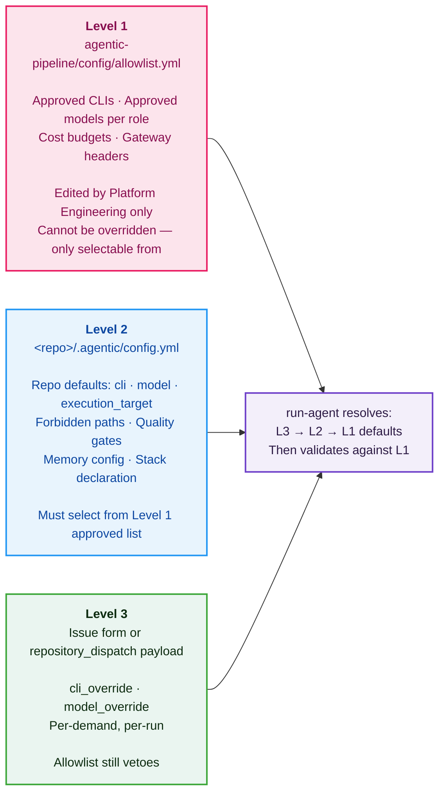

# Configuration

Configuration resolves in three levels. **Level 3 wins on values; Level 1 always vetoes.**



---

## Level 1 — `config/allowlist.yml` (Platform Governance)

Edited by Platform Engineering only. Defines what CLIs and models are approved to exist at all.

```yaml
clis:
  dry-run:    { approved: true, adapter: actions/run-agent/adapters/dry-run.sh }
  claude-code: { approved: true, adapter: actions/run-agent/adapters/claude-code.sh }
  cursor:     { approved: true, adapter: actions/run-agent/adapters/cursor.sh }
  codex:      { approved: true, adapter: actions/run-agent/adapters/codex.sh }

models:
  po:                 [dry-run, codex-1, claude-sonnet-4-6, gpt-5-mini]
  tech-lead:          [dry-run, codex-1, claude-opus-5, claude-sonnet-4-6]
  frontend-engineer:  [dry-run, codex-1, claude-sonnet-4-6, gpt-5]
  backend-engineer:   [dry-run, codex-1, claude-sonnet-4-6, gpt-5]
  qa:                 [dry-run, codex-1, claude-sonnet-4-6]

budgets:
  default_usd_per_demand: 5
  hard_stop_usd_per_demand: 10
```

---

## Level 2 — `.agentic/config.yml` (Repo Defaults)

Each product/intake repo defines its defaults here. Values must be from the Level 1 approved list.

```yaml
# app-poc-1 example
version: 1
repo_role: product
defaults:
  cli: codex
  execution_target: cloud        # local | cloud
  models:
    frontend-engineer: codex-1

roles_enabled: [frontend-engineer, qa]
stack: { runtime: node@22, framework: react, bundler: vite }

constraints:
  forbid_paths: [.github/workflows/**, .agentic/config.yml]
  forbid_dependencies_add: true

memory:
  enabled: true
  max_episodes: 20

gates: [build, test]
pr: { base_branch: main, draft: true, labels: [agentic] }
```

---

## Level 3 — Dispatch Payload Override (Per-Demand)

Override the CLI, model, or execution target for a single demand. The allowlist still vetoes invalid values.

```yaml
# In poc-agentic-intake/.github/workflows/on-issue.yml
with:
  cli_override: ""              # leave empty to use Level 2 default
  model_override: ""            # leave empty to use Level 2 default
  execution_target: ""          # leave empty to use Level 2 default
```

---

## `capability-map.yml` vs `allowlist.yml`

These two files serve different purposes:

| File | Purpose |
|---|---|
| `allowlist.yml` | **Governance** — what CLIs/models are approved to exist at all |
| `capability-map.yml` | **Routing** — which product repos exist, their domain, and implication rules |

`capability-map.yml` also contains implication rules: for example, changing `app-poc-2`'s API contract likely implies `app-poc-1` must also change. The `agentic-pipeline` and `poc-agentic-intake` repos are explicitly excluded from automatic scope selection.

---

← [Back to README](../README.md) · [Roles & Skills →](./roles-and-skills.md)
