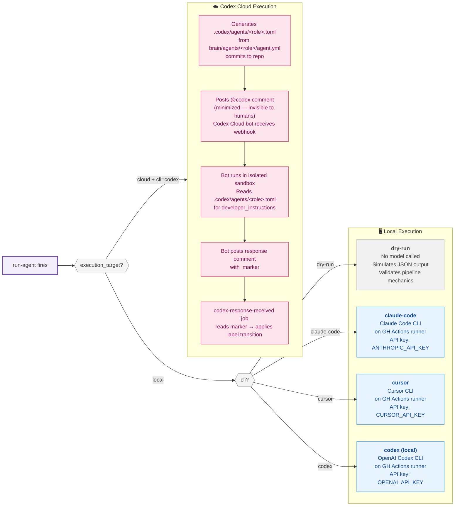
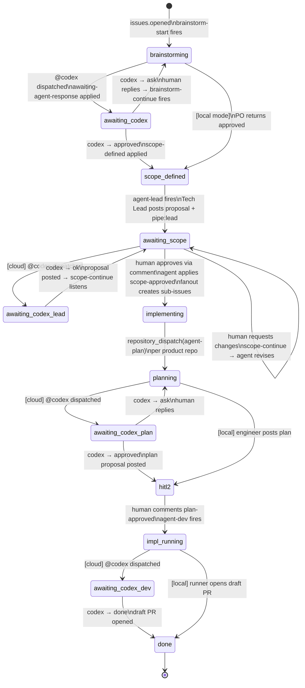

# Execution Modes

Every agent run goes through `run-agent` (composite action), which resolves the execution mode from three levels of config. The mode determines what actually runs.



---

## Mode Comparison

| | `dry-run` | Local CLI | Codex Cloud |
|---|---|---|---|
| **Model called** | No | Yes | Yes (via Codex Cloud) |
| **Runs on** | GH Actions runner | GH Actions runner | Codex Cloud sandbox |
| **API key needed** | None | CLI-specific | None (GitHub App) |
| **Config** | `cli: dry-run` | `cli: claude-code \| cursor \| codex` + `execution_target: local` | `cli: codex` + `execution_target: cloud` |
| **Output** | Synthetic JSON | Real agent output | Codex bot comment |
| **Pipeline sees** | Simulated result | Adapter stdout | `<!-- codex:status:X -->` marker |
| **Useful for** | Validating mechanics, CI, cost-zero testing | Full local execution | Codex Cloud subscription users |

---

## POC Default Configuration

All three product/intake repos are currently set to **Codex Cloud**:

```
poc-agentic-intake   → cli: codex · execution_target: cloud · po/tech-lead: codex-1
app-poc-1            → cli: codex · execution_target: cloud · frontend-engineer/qa: codex-1
app-poc-2            → cli: codex · execution_target: cloud · backend-engineer/qa: codex-1
```

---

## Codex Cloud — State Machine

When `execution_target: cloud` is active, the pipeline becomes a state machine driven by Codex bot responses rather than synchronous adapter output.



### How the Bot Response Is Processed

```
Codex bot posts comment
  └── codex-response-received job fires (on-issue.yml in intake)
        ├── extracts <!-- codex:status:X --> marker from comment body
        ├── removes awaiting-agent-response label
        ├── reads current labels to identify stage
        └── applies transition:
              brainstorming + ask     → keep brainstorming
              brainstorming + approved → remove brainstorming
                                         add scope-defined
              awaiting-scope + ok     → post proposal comment; scope-continue now handles human replies
              escalated               → remove labels, log, stop
```

### Role Contract Delivery in Cloud Mode

In Codex Cloud, the agent runs in a repo sandbox — not in the GitHub Actions runner. The system prompt must reach it via the repo's `.codex/agents/<role>.toml` file.

`run-agent` generates and commits this file automatically before dispatching:

```
brain/agents/<role>/agent.yml          ← source of truth (platform owns this)
        ↓  to-codex-toml.sh
.codex/agents/<role>.toml              ← generated at dispatch time, committed to repo
        ↓  Codex Cloud reads
developer_instructions = """           ← role contract (XML system prompt, cloud output format)
```

The TOML is regenerated on every dispatch. Product repos never maintain it manually. The platform is always the source of truth.

---

← [Back to README](../README.md) · [Phases](./phases.md) · [Adapters →](./adapters.md)
